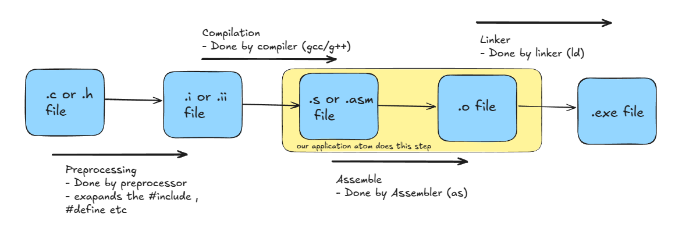

# ` ATOM ` : ASSEMBLY TO MACHINE


```

        _                  
       | |                 
   __ _| |_ ___  _ __ ___  
  / _` | __/ _ \| '_ ` _ \ 
 | (_| | || (_) | | | | | |
  \__,_|\__\___/|_| |_| |_|
                           
                            ~a pdp-11 assembler
```


[
][contributors-url]
[
][commit-url]
[][language-url]


[contributors-url]: https://github.com/neo-0007/pdp-11-assembler/graphs/contributors
[commit-url]:https://github.com/neo-0007/pdp-11-assembler/commits/main/
[language-url]: https://github.com/search?q=repo%3Aneo-0007%2Fpdp-11-assembler++language%3AC&type=code

<!-- TABLE OF CONTENTS -->
<details>
  <summary>Table of Contents</summary>
  <ol>
    <li>
      <a href="#about-the-project">About The Project</a>
      <ul>
        <li><a href="#documentation">documentation</a></li>
      </ul>
    </li>
    <li>
      <a href="#getting-started">Getting Started</a>
      <ul>
        <li><a href="#prerequisites">Prerequisites</a></li>
        <li><a href="#installation">Installation</a></li>
      </ul>
    </li>
    <li><a href="#contributing">Contributing</a></li>
    <li><a href="#roadmap">Roadmap</a></li>
    <li><a href="#acknowledgments">Acknowledgments</a></li>
  </ol>
</details>
<br>

# About The Project

Atom is a assembler for pdp-11, So what is this pdp-11 and what the hell is an assembler ?<br>


The giant, ancient thing you see above is a computer – the **PDP-11**. It was one of the most popular and successful computers of its time. Even legends like Ken Thompson and Dennis Ritchie wrote code on it – cool, right? Another fun fact is that the journey of programming languages like C and the Unix operating system all began with it!. And yes we have written a application for this 55 years old computer which can be found in museums. you may ask why , you can ask this question to the people who have created the syllabus for Computer Science Enginnering in India , but it was fun we get a better understanding of how computers work. <br>

Now let me come to the application an Assembler , So what does a assembler does simply a assembler converts human readable (almost readable) assembly code to machine readable binary code (ones and zeros) . So we humans cannot make sense out of 0's and 1's and similarly the computers cannot understand english or code language we understand. SO the assembler works as a translator for converting instructions (code) in a code language we humans write to machine language which a computer can run. In this case its Assembly to Binary<br>

Lets see an example:

Below is an assembly code that will be the input for our application:
```asm
START:
MOV #10 R1 ;Storing 10 in a register R1
MOV #5  R2 ;Storing 5 in a register R2
ADD R1  R2 ;Add R1 and R2 and store it in R1
```
And this is its corresponding output:

```bin
0001010111000001
0000000000001010
0001010111000010
0000000000000101
0110000001000010
```

Now many of you who have been programming in high level languages like C, python, Java etc. in the end your code gets converted to this kind of 0's and 1's after the process of compilation or interpretaion. and before conversion to binary it gets converted to assembly. The binary code for a program will be different for different cpu , and so is the assembly code. For a AMD-Ryzen proccessor it will be different than an Intel processor also for intel i7 and i3 it will be different. Below is a representation of compilation of a C program :



**So In summary our application converts PDP-11 Assembly to .o(object) file** 
<br>
<br>

<p align="right">(<a href="#readme-top">back to top</a>)</p>

# Getting started

This is an example of how you may give instructions on setting up your project locally.
To get a local copy up and running follow these simple example steps.

### Prerequisites

Ensure you have the following installed before building the assembler:
* GCC (GNU Compiler Collection)
  ```sh
  gcc --version  # Check if installed
  ```
  if not installed:
  * Linux (Debian/Ubuntu):
    ```sh
    sudo apt update && sudo apt install gcc
     ```
  * macOS (using Homebrew):
    ```sh
    brew install gcc
     ```
  * Windows (MinGW or WSL): Install MinGW or enable WSL and use GCC from a Linux environment.

* Make (Build Automation Tool) *optional*
    ```
    make --version  # Check if installed
    ```
    If not installed :
    * Linux(Debian/Ubuntu):
        ```sh
        sudo apt install make
        ```
    * macOS:
        ```
        xcode-select --install
        ```

### Installation

Follow these steps to set up and build the assembler:

1. Clone the repo
   ```sh
   git clone https://github.com/github_username/pdp-11-assembler.git

   cd pdp-11-assembler
   ```
2. Compile the source code using make:
   ```sh
   make
   ```
4. Run the assembler
   ```sh
   ./atom input.example.asm # replace with your input file
   ```
5. Clean up compiled files (optional):
   ```sh
   make clean
   ```
6. Change git remote URL to avoid accidental pushes to the base project:
    ```sh
    git remote set-url origin github_username/pdp-11-assembler
    
    git remote -v  # Confirm the changes
    ```

<p align="right">(<a href="#readme-top">back to top</a>)</p>


# Contributing

Contributions are what make the open source community such an amazing place to learn, inspire, and create. Any contributions you make are **greatly appreciated**.

If you have a suggestion that would make this better, please fork the repo and create a pull request. You can also simply open an issue with the tag "enhancement".
Don't forget to give the project a star! Thanks again!

1. Fork the Project

2. Create your Feature Branch 
    ```sh
    git checkout -b feature/AmazingFeature`
    ```

3. Commit your Changes 
    ```sh
    git commit -m 'Add some AmazingFeature'`
    ```

4. Push to the Branch 
    ```sh
    git push origin feature/AmazingFeature`
    ```

5. Open a Pull Request

### Top contributors:

<a href="https://github.com/neo-0007/pdp-11-assembler/graphs/contributors">
  
</a>

<p align="right">(<a href="#readme-top">back to top</a>)</p>


# Roadmap

- [x] Task1
- [ ] Task2

See the [open issues](https://github.com/neo-0007/pdp-11-assembler/issues) for a full list of proposed features (and known issues).

<p align="right">(<a href="#readme-top">back to top</a>)</p>

# Acknowledgments

Use this space to list resources you find helpful and would like to give credit to. I've included a few of my favorites to kick things off!
